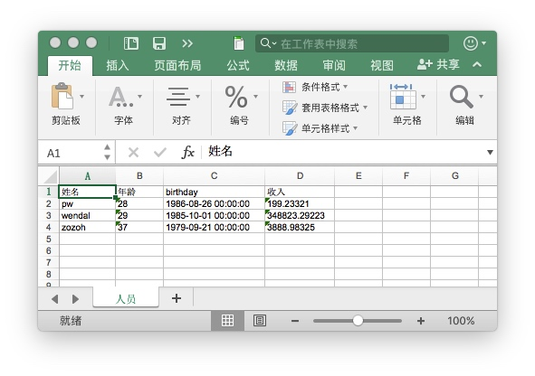

json4excel(简称j4e)
==================================

简介(可用性:生产)
==================================

[Apache POI](https://poi.apache.org/)项目的封装，简化了一些常见的操作

# 项目的由来

很多项目都有数据导入，导出，或生成各种业务报表的需求，而Excel是其中最常见也最具可读性的格式，所以被广泛使用。

POI封装了对Excel的基本读写操作，j4e是其基础上按照Nutz使用习惯封装了一套常见操作接口，目标就是简化这个操作过程，让我们可以更加专心书写业务代码。


# 使用手册

## 基本的导入导出

基本上来说Excel中的一个Sheet对应Java中的一个POJO对象，导入导出都是以该对象为基础。

比如我们要导出一个表的数据，假如说这个表是Nutz创建的POJO，那么它应该长这样：

```java
@Table("t_person")
public class Person {

    @Name
    private String name;

    private int age;

    private Date birthday;
    
    @ColDefine(type = ColType.FLOAT, width = 20, precision = 5)
    private double income;

    //  下面省略了get set方法，自行脑补

}

```

接着我们要在这个对象上添加一些j4e的配置，这里主要是需要确定sheet名称与列名称

```java
@Table("t_person")
@J4EName("人员")
public class Person {

    @Name
    @J4EName("姓名")
    private String name;

    @J4EName("年龄")
    private int age;

    private Date birthday;
    
    @J4EName("收入")
    @J4EDefine(type = J4EColumnType.NUMERIC, precision = 5)
    @ColDefine(type = ColType.FLOAT, width = 20, precision = 5)
    private double income;

    //  下面省略了get set方法，自行脑补

}
```

接下来就是导出操作了, 下面的数据库相关操作都以nutz为准，不太熟的可以看下[官网文档](https://nutzam.com/core/dao/hello.html)

```java

// 第一步，查询数据得到一个数据集合
List<Person> people = dao.query(Person.class, null);  
 
// 第二步，使用j4e将数据输出到指定文件或输出流中
J4E.toExcel(Files.createFileIfNoExists2("~/人员.xls"), people, null);  
   
```
看看生成的文件



接着我们再测试下导入，就把刚刚导出的数据直接再写回数据库看看

```java

// 第一步，使用j4e解析excel文件获得数据集合
InputStream in = Files.findFileAsStream(Disks.absolute("~/人员.xls"));
List<Person> people = J4E.fromExcel(in, Person.class, null);

// 第二步，插入数据到数据库
dao.clear(Person.class); 
dao.insert(people);

```
看看数据库里


是不是很简单


# 后续开发计划

// TODO


